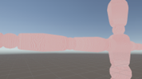
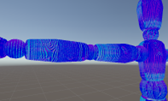
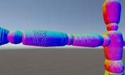

关于PBR中的NormalMap
-------------------
1.法线贴图在使用``SAMPLE_TEXTURE2D(_NormalTex,sampler_NormalTex,i.uv)``进行采样后，采集到的只是一张图片，图片具体的意义是表示法线在切线空间下的偏移值，在shader中被作为颜色（half4）存储。还无法进行使用。  
2.要进行使用，我们首先要把颜色转换成法线在切线空间下的偏移值。按专业的话来说，就是把发现贴图数据从颜色空间（RGB）转换为法线空间（XYZ）在unity中，我们可以通过UnpackNormal函数来完成这个操作。我们知道，对于没有偏移的法线，对应的颜色是（128，128,128）。根据一些标准即可完成转换，完成转换后的法线，我们称之为packNormal。  
3.随后，要实现法线贴图的深度变化，我们可以让``packNormal.xy *= NormalScale``，因为我们知道，法线的偏移实际有意义的是在xy分量上，z分量是辅助xy分量让法线成为单位向量的，因此在最后，我们需要让``packNormal``的z分量等于``sqrt(1 – saturate(dot(packNormal.xy,packNormal.xy)))``
在Unity URP中，实际上我们可以通过UnpackNormalScale函数来实现2,3两步。  
4.之后，只要把切线空间下的法线转换为世界空间下就行了。制作这种操作，当然得用到tbn矩阵，因为我们要让packNormal经过tbn矩阵进行变换，所以应该是``mul(normalTS,tbn)``。  
5.最后，通过用对法线专门归一化的``NormalizeNormalPerPixel()``函数进行归一化。  

|  |  |  |
|---------------------|-------------------------|-------------------------|
| 步骤1                 | 步骤3                     | 步骤6                     |

完整代码如下
```hlsl
half4 normal = SAMPLE_TEXTURE2D(_NormalTex,sampler_NormalTex,i.uv);
float3x3 tbn = {i.tangetWS,i.bitTangetWS,i.normalWS};
float3 normalTS = UnpackNormalScale(normal,_NormalScale);
normalTS.z = sqrt(1 - saturate(dot(normalTS.xy,normalTS.xy)));
half3 N = NormalizeNormalPerPixel(mul(normalTS,tbn));
```
