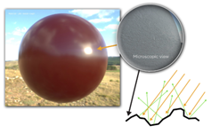

> 本文仅是个人对PBR的一些总结与理解  
> 更详细的文章推荐参考毛星云大佬的[PBR白皮书开篇](https://zhuanlan.zhihu.com/p/53086060)

BRDF模型与微平面理论
-------------------
**1.一些准备：**  
PBR（Physically Based Rendering）是一个光照/着色模型。它的特点在于，使用了基于物理原理的微平面理论（cook——Torrance）进行建模。  
PBR相对于传统的Lambert，最大的不同在于对Specular（高光反射）的处理，因此，本文会着重于讲述PBR中的BRDF。  
本文的Specular光照是建立在微平面理论 BRDF下的。  
微平面理论认为，物体的表面在微观上并不是光学平坦（光滑）的，存在着许多凹凸不平的平面。 光和物体的表面发生各种行为时，更像是一系列微小的光学平滑
平面发生的结果，其中每个小平面，会把光引入不同的方向。在实际的PBR流程中，物体表面的凹凸不平通常由粗糙度贴图或高光贴图来表示。 在微观尺度上，表面越
粗糙，表面取向就和整个宏观表面的取向偏离更强，因此反射就会越模糊。

|  |  |
|---------------------|-------------------------|
| 微平面理                | 表面越粗糙，反射越模糊             |

对于这些微平面，在宏观上，我们一般认为它们的尺度**小于观察尺度**（比如着色后的分辨率），但**大于光的波长**（因此它们相对来说是光学平坦的，会影响到光
最后的折射/反射结果）。因此，在实际的渲染中，我们会把这些微平面的集合视为一个点。反过来说，我们计算一束光打在一个点之后会如何反射，要考虑到
这个点里面所有微平面的影响。详细的计算每一个微平面的影响是不现实的，所以，我们会采取一种类似统计学的方式来量化这种影响。比如，我们会通过
一个函数，计算出大概有多少微平面会把光反射到“正确”的方向（即view方向），大概有多少光会被微平面遮蔽。  
最后，在实时渲染中，我们一般会使用BRDF公式，来计算物体的高光反射。  

**2.BRDF公式：**  
BRDF其实是BxDF的一种，而BxDF是对BRDF，BSDF等双向分布函数的一个统一的表示。我们目前使用的BRDF是迪士尼标准下的。迪士尼公司将PBR复杂的物理属性，用
非常少的，非常直观的变量表达了出来（如Roughness，Metallic等）。  
BRDF具体的推导过程请参见[基于物理的渲染：微平面理论(Cook-Torrance BRDF推导)](https://zhuanlan.zhihu.com/p/152226698)  
公式如下：  
$$
f(l,v) = \frac{D(h)F(v,h), G(l,v,h)}{4(n \cdot l)(n \cdot v)}
$$
其中:  
$D(h)$：法线分布函数。描述正确的微平面法线的分布概率。  
$F(v,h)$：菲涅耳方程。描述在不同的表面角度下，表面反射的光所占的比率。  
$G(l,v,h)$：几何遮蔽函数，描述被微平面遮挡住的入射光。  
分母$4(n \cdot l)(n \cdot v)$：校正因子。  
对BRDF中的参数更详细的解释请见下文。

