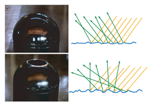

> 本文仅是个人对PBR的一些总结与理解  
> 更详细的文章推荐参考毛星云大佬的[PBR白皮书开篇](https://zhuanlan.zhihu.com/p/53086060)

微平面理论与BRDF模型
-------------------
**1.准备：**  
PBR（Physically Based Rendering）是一个光照/着色模型。它的特点在于，使用了基于物理原理的微平面理论（cook——Torrance）进行建模。  
PBR相对于传统的Blinn-Phone，最大的不同在于对Specular（高光反射）的处理，因此，本文会着重于讲述PBR中的Specular。   
微平面理论认为，物体的表面在微观上并不是光学平坦（光滑）的，存在着许多凹凸不平的平面。 光和物体的表面发生各种行为时，更像是和一系列微小的光学平滑的平面发生的结果，其中每个小平面，会把光引入不同的方向。在实际的PBR流程中，物体表面的凹凸不平通常由粗糙度贴图或高光贴图来表示。 在微观尺度上，表面越 粗糙，表面取向就和整个宏观表面的取向偏离更强，因此反射就会越模糊。

|  |  |
|-------------------|------------------------|
| 微平面理              | 表面越粗糙，反射越模糊            |

对于这些微平面，在宏观上，我们一般认为它们的尺度**小于观察尺度**（比如着色后的分辨率），但**大于光的波长**（因此它们相对来说是光学平坦的，会影响到光 最后的折射/反射结果）。因此，在实际的渲染中，我们会把这些微平面的集合视为一个点。反过来说，我们计算一束光打在一个点之后会如何反射，要考虑到 这个点里面所有微平面的影响。详细的计算每一个微平面的影响是不现实的，所以，我们会采取一种类似统计学的方式来量化这种影响。比如，我们会通过 一个函数，计算出大概有多少微平面会把光反射到“正确”的方向（即view方向），大概有多少光会被微平面遮蔽。最后，在实时渲染中，我们一般会使用BRDF公式，来计算物体的高光反射。

**2.参数的理解**  
在开始学习BRDF公式之前，我们首先要理解一些参数的具体意义。  
$n$: 宏观上的法线方向。一般要经过法线贴图的采样，Unpack和tbn转换，代码为：``float3 normalDir = normalize(N);``  
$l$: 光照方向。光源的方向。主光源和其它光源有不同的获取方式。在这里，我们先只考虑主光源，代码为：``float3 lightDir = GetMainLight().direction;``  
$v$: 视角方向。需要注意的是，这个方向一般不和摄像机的朝向相关，只和摄像机的位置相关。在顶点着色器中，我们会通过``o.viewDirWS = GetCameraPositionWS() - o.positionWS;``获取到这个方向，最后在片元着色器中归一化：``float3 viewDir = normalize(i.viewDirWS);``  
$\alpha$: 光滑度。需要注意的是，暴露给开发者的smoothness参数要在经过重映射后才能转换成公式中的 $\alpha$ ，一般是进行平方 具体代码为： ``half smoothness = pow(_Smoothness,2)`` 如果打算暴露给开发者roughness参数，则需要取反，则为``half roughness = pow(1 - _Roughness,2)``  
$h$: 半程向量，又被称为中间向量。这个向量在我们学习Blinn计算高光时就见到过，``float3 halfDir = normalize(lightDir + viewDir);``。它实际上计算的是 $v$ 和 $l$ 中间的对称轴。在Phone模型中，我们要计算高光强度时，往往要计算反射光的方向，再计算反射光和视角方向的点乘从而确定高光强度。在Blinn模型中，则使用 $h$ 和法线的点乘来计算高光强度。而在BRDF中，我们也会利用h来计算高光强度。具体来说，如果微平面的法线方向等于这个 $h$ ，就说明光线经过这些微平面反射后可以到观察者的视角中。

  
Blinn模型下的h，BRDF下的h请参照法线分布函数中的图

**3.BRDF公式：**  
BRDF其实是BxDF的一种，而BxDF是对BRDF，BSDF等双向分布函数的一个统一的表示。我们目前使用的BRDF是迪士尼标准下的。迪士尼公司将PBR复杂的物理属性，用非常少，非常直观的变量表达了出来（如Roughness，Metallic等）。BRDF其实是在描述Specular（高光反射），它是基于微平面理论的。  
BRDF具体的推导过程请参见[基于物理的渲染：微平面理论(Cook-Torrance BRDF推导)](https://zhuanlan.zhihu.com/p/152226698)  
公式如下：  
$$
f(l,v) = \frac{D(h)F(v,h), G(l,v,h)}{4(n \cdot l)(n \cdot v)}
$$
其中:  
$D(h)$: 法线分布函数。描述正确的微平面法线的分布概率。  
$F(v,h)$: 菲涅耳方程。描述在不同的表面角度下，表面反射的光所占的比率。  
$G(l,v,h)$: 几何遮蔽函数，描述被微平面遮挡住的入射光。  
分母$4(n \cdot l)(n \cdot v)$: 校正因子。 
对BRDF中的参数更详细的解释请见下文。

**5.法线分布函数 D(H)**  
对于光学平坦的平面来讲，入射光会被反射到出射方向。微平面也是如此。出射方向取决于入射光的角度，平面的朝向（也就是法线方向）。对于微平面来说，不同的微平面有不同的法线朝向，我们称其为微观法线m。在一个点上，微平面的朝向是不同的，一些微观平面能正确的把光反射到视角方向v，这些微观平面是有助于BRDF值的。对于这些“正确朝向”的微观平面，它们的法线方向为h。也就等于视角方向和光线方向的半程向量。也就是说，只有**m=h**的微观平面，才对BRDF有贡献。**$D(h)$ 就是在计算这些微观平面的分布概率**。

  
仅当m=h的表面点才能把光正确的反射到视角方向v  

对于该函数，已经衍生出许多不同的计算方法和模型，这里我们（Unity）选用的是**Trowbridge-Reitz GGX(GGXTR)** 模型。
具体公式如下：
$$
NDF_{GGXTR}(n,h,\alpha)=\frac{\alpha^2}{\pi((n \cdot h)^2(\alpha^2-1)+1)^2}
$$
简单回顾下这些参数的意义, $n$ 表示法线方向， $h$ 表示半程向量， $\alpha$ 表示粗糙度。
这个公式给出了在宏观表面法线为 $n$ ，粗糙度为 $\alpha$ 时，微平面法线为 $h$ 的概率密度。这个公式是根据统计建模得到的。比较具体的推导过程在[法线分布函数的相关总结](https://zhuanlan.zhihu.com/p/69380665)里有详细的说明。  
具体代码如下：
``` hlsl
float Distribution(float roughness ,float normalDir,float halfDir)
{
    float lerpSquareRoughness = pow(lerp(0.01,1,roughness),2);
    float D = lerpSquareRoughness / (pow(pow(dot(normalDir,halfDir),2) * (lerpSquareRoughness - 1) + 1,2) * PI);
    return D;
}
```
进行``lerp(0.01,1,roughness)``插值的原因，是为了避免roughness为0。  
shader直接输出 $D$ ，roughness在0~1时材质的表现效果：

| 图片        |  |  |  |  |  |  |
|-----------|---------------------|-----------------------|-----------------------|-----------------------|-----------------------|----------------------|
| Roughness | 0.0                 | 0.2                   | 0.1                   | 0.6                   | 0.8                   | 1.0                  |

**6.几何遮蔽函数 G(l,v,h)**  
通过法线分布函数，我们得以统计出拥有“正确朝向”的微平面。然而，不是所有拥有正确朝向（微观法线m=h）的微平面都能把光反射到观察者中。  
如下图所示。在左边，一些微平面的入射光会被其它平面遮挡；在中间，出射光会被其它的平面遮挡。在这两种情况下，这些“正确朝向”的微平面并无法为BRDF做出贡献。事实上，如果经过多次反射，一些光最后还是能被观察到。不过在微平面理论中一般会忽略这些情况。
  

在一部分游戏引擎和文献中，几何函数 $G(l,h,v)$ 会和分母中的校正因子 $4(n \cdot l)(n \cdot v) $ 合并为可见性项，其也经常作为几何函数的代指:
$$
V(v,l) = \frac{G(l,v,h)}{4(n \cdot l)(n \cdot v)}
$$
之后我们要对 $G(l,v,h)$ 进行计算建模和计算。几何函数 $G$ 分为两个部分。一个部分用于计算**光照方向**上，由于微平面遮蔽而导致的光线衰减，另一个部分则计算**视角方向**上的光线衰减。需要注意的是，它们计算的不是直接的概率，而是一个衰减因子。  
因此，我们先要计算几何遮蔽函数的子相。下面的公式是那 $v$ 方向的例子， $l$ 方向上的公式只需替换 $v$ 为 $l$ 即可。该几何函数我们选用了由**GGX**和**Schlick-Beckmann**组合而成的模拟函数**Schlick-GGX**。
具体公式为：
$$
G_{SchlickGGX}(n,v,k)=\frac{n \cdot v}{(n \cdot v)(1-k)+k}
$$
在这个公式中，k是使用粗糙度 $\alpha$ 计算得出的，这就意味着表面越粗糙，微平面产生自阴影的概率就越高。对于**直接光照**，k的取值如下：
$$
k_{direct}=\frac{(\alpha+1)^2}{8}
$$
对于**IBL光照(Image Based Lighting)**，即环境光照，k的取值如下
$$
k_{IBL}=\frac{\alpha^2}{2}
$$  
最后，在考虑两个视角，视线方向和光线方向后，我们会使用**Smith函数**将两个部分连接到一起，即：
$$
G_{sub}(n,v,k)G_{sub}(n,l,k)=G(n,v,l,k)=\frac{n \cdot v}{(n \cdot v)(1-k)+k} \cdot \frac{n \cdot l}{(n \cdot l)(1-k)+k}
$$  
需要注意的是，在严格意义上，光照方向和视角方向上的遮蔽概率是两个独立的事件，并不能直接相乘。这里相乘更多是因为已经达成需求以及工程上的妥协。更先进的模型可以参考Height-Correlated Smith。  
在编写代码时，我们可以用lerp来替代 $(1-k)a + k$ 相关代码如下：
```hlsl
//几何遮蔽子项
float G_sub(float3 normalDir,float3 anotherDir,float k)
{
    float dotProduct = dot(normalDir,anotherDir);
    dotProduct = max(dotProduct,0);
    return dotProduct/lerp(dotProduct,1,k);
}

//几何遮蔽函数
float Geometry(float roughness ,float3 normalDir,float3 viewDir,float3 lightDir)
{
    //例子里使用直接光照
    float k = pow(roughness + 1,2) / 8;

    float G1 = G_sub(normalDir,viewDir,k);
    float G2 = G_sub(normalDir,lightDir,k);

    float G = G1 * G2;
    
    return G;
}
```  
shader直接输出 $G$ ，roughness在0~1时材质的表现效果：

| 图片        |  |  |  |  |  |  |
|-----------|-------------------|---------------------|---------------------|---------------------|---------------------|--------------------|
| Roughness | 0.0               | 0.2                 | 0.1                 | 0.6                 | 0.8                 | 1.0                |


