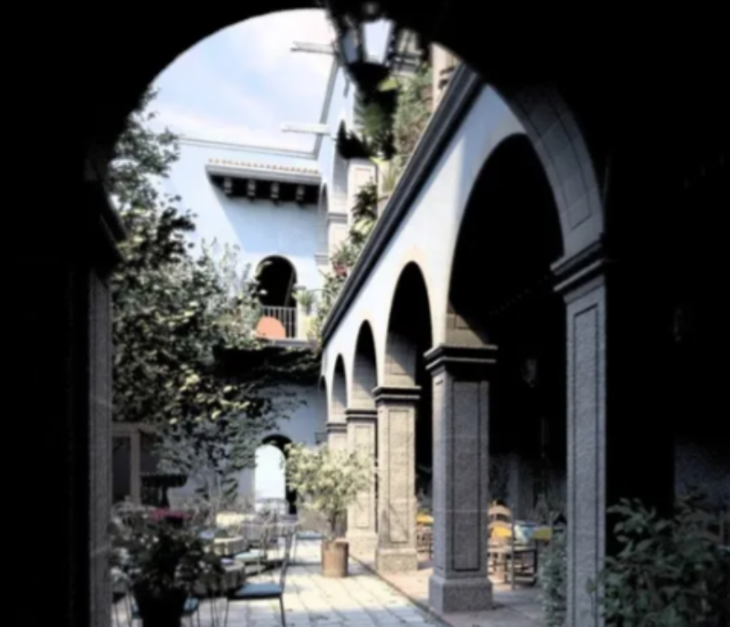

> 本文仅是个人对PBR的一些总结与理解  
> 由于个人对于球谐光照的数学原理只能做到粗浅的理解，因此本文不会详细阐述其数学原理  
> 具体的原理介绍可以参考 [球谐函数原理解释](https://mp.weixin.qq.com/s/dW6Kz_jyS503QTtLnyK6og)

间接光照
-------------------

**1.直接光照，间接光照和全局光照**  
在进入本章的学习前，我们首先需要理解直接光照，间接光照，全局光照是什么，并理解他们之间的关系。  
简单的说：  
**直接光照(DirectLight)**：直接照射到物体上，没有经过反射的光。上一章的BRDF就属于这个范畴。  
**间接光照(Indirect Light)**：光线在场景进行一次或多次反射或折射后，最终得到物体表面的光。  
**全局光照(Global Illumination,GI)**：直接光照和间接光照的总和，

|  |  |
|----------------|----------------|
| 直接光单独的光照效果     | 直接光加上间接光后的效果   |

**直接光照**：  
定义：光直接从光源（点光源、平行光 、聚光灯）发出，照射到物体表面，并根据表面材质属性（颜色、光滑度）和基础的照明模型（如Lambert漫反射，Blinn-Phone高光，BRDF）计算出的光照。  
表现：清晰的阴影边界，物体表面的高光的亮点，基本的明暗关系都是通过处理直接光进行表现的。  
引擎中的相关操作有：控制灯光的颜色、强度、范围、衰减；控制阴影的类型等。 

**间接光照**：  
定义：光源从光线发出后，击中物体表面（A），然后反弹到另一个物体表面（B），并对B产生照面的过程。这个过程可以发生多次。  
表现：颜色的渗透（比如红墙会把它的红光反射到白色的沙发上）、柔和的漫反射（照亮直接光无法照射到的角落，避免这些区域死黑一片）、视觉的连贯性（将场景中的物体通过光线联系起来，让画面更自然、统一、可信）  
引擎中的实现方式：具体的作用和操作方法会在后续指出。  
光照烘培：将间接光照预先计算并存储到光照贴图中。高性能，但需要把物体设置为静态，静态物体无法移动。  
光照探针：在空间中放置“采样点”，存储该点接受到的间接光照信息，动态物体经过后，会根据这些采样点的信息来获取光照信息。从而让动态物体能融入静态环境光。  
反射探针：采样周围环境，合成一张立方体贴图。在实时渲染中，光滑的物体会根据自身附近的反射探针来决定自己反射什么样的信息(即镜面反射)。  

**全局光照**：  
全局光模拟了光线在场景中物体之间传播和反射的过程，从而呈现出更为真实和自然的光照效果。通用全局光的方法主要有辐射度算法，光线追踪算法和光子映射。其中光线追踪是实现全局光的最佳方法之一，计算量很大。在这一张，我们不会花时间在全局光照上，后续用到时会对齐进行详尽的解释。

**2.引擎的全局光照方案**  
接下来主要是围绕间接光的实现。  
按实现的方式，可以分为：  
离线方法：所有光照计算离线完成。  
半实时：结合实时光照信息，与计算光照传输PRT预计算方向性。  
实时：所有光照全部实时计算

**3.光照探针(Light Probe)**  
Unity官网，是这样解释光照探针的：  
通过**光照探针**可以捕获并使用穿过场景空白空间的光线的相关信息。  
与光照贴图类似，光照探针存储了有关场景中的光照的“烘焙”信息。不同之处在于，光照贴图存储的是有关光线照射到场景中的表面的光照信息，而光照探针存储的是有关光线穿过场景中的空白空间的信息。  
光照探针是在烘焙期间测量（探测）光照的场景位置。在运行时，系统将使用距离动态游戏对象最近的探针的值来估算照射到这些对象的间接光。