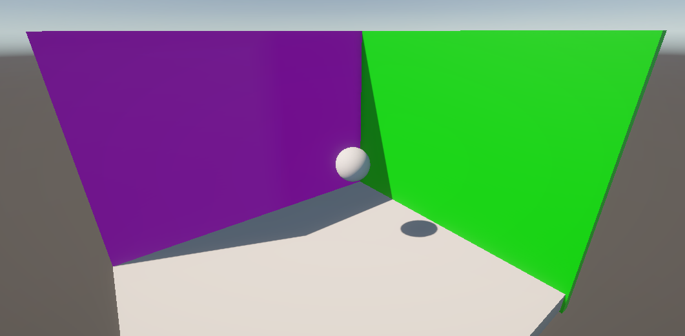

> 本文仅是个人对PBR的一些总结与理解  
> 由于个人对于球谐光照的数学原理只能做到粗浅的理解，因此本文不会详细阐述其数学原理  
> 具体的原理介绍可以参考 [球谐函数原理解释](https://mp.weixin.qq.com/s/dW6Kz_jyS503QTtLnyK6og)

间接光照
-------------------

**1.直接光照，间接光照和全局光照**  
在进入本章的学习前，我们首先需要理解直接光照，间接光照，全局光照是什么，并理解他们之间的关系。  
简单的说：  
**直接光照(DirectLight)**：直接照射到物体上，没有经过反射的光。上一章的BRDF就属于这个范畴。  
**间接光照(Indirect Light)**：光线在场景进行一次或多次反射或折射后，最终得到物体表面的光。  
**全局光照(Global Illumination,GI)**：直接光照和间接光照的总和，

|  |  |
|----------------|----------------|
| 直接光单独的光照效果     | 直接光加上间接光后的效果   |

**直接光照**：  
定义：光直接从光源（点光源、平行光 、聚光灯）发出，照射到物体表面，并根据表面材质属性（颜色、光滑度）和基础的照明模型（如Lambert漫反射，Blinn-Phone高光，BRDF）计算出的光照。  
表现：清晰的阴影边界，物体表面的高光的亮点，基本的明暗关系都是通过处理直接光进行表现的。  
引擎中的相关操作有：控制灯光的颜色、强度、范围、衰减；控制阴影的类型等。 

**间接光照**：  
定义：光源从光线发出后，击中物体表面（A），然后反弹到另一个物体表面（B），并对B产生照面的过程。这个过程可以发生多次。  
表现：颜色的渗透（比如红墙会把它的红光反射到白色的沙发上）、柔和的漫反射（照亮直接光无法照射到的角落，避免这些区域死黑一片）、视觉的连贯性（将场景中的物体通过光线联系起来，让画面更自然、统一、可信）  
引擎中的实现方式：具体的作用和操作方法会在后续指出。  
光照烘培：将间接光照预先计算并存储到光照贴图中。高性能，但需要把物体设置为静态，静态物体无法移动。  
光照探针：在空间中放置“采样点”，存储该点接受到的间接光照信息，动态物体经过后，会根据这些采样点的信息来获取光照信息。从而让动态物体能融入静态环境光。  
反射探针：采样周围环境，合成一张立方体贴图。在实时渲染中，光滑的物体会根据自身附近的反射探针来决定自己反射什么样的信息(即镜面反射)。  

**全局光照**：  
全局光模拟了光线在场景中物体之间传播和反射的过程，从而呈现出更为真实和自然的光照效果。通用全局光的方法主要有辐射度算法，光线追踪算法和光子映射。其中光线追踪是实现全局光的最佳方法之一，计算量很大。在这一张，我们不会花时间在全局光照上，后续用到时会对齐进行详尽的解释。

**2.引擎的全局光照方案**  
接下来主要是围绕间接光的实现。  
按实现的方式，可以分为：  
离线方法：所有光照计算离线完成。  
半实时：结合实时光照信息，与计算光照传输PRT预计算方向性。  
实时：所有光照全部实时计算

**3.离线烘培(Bake)**  
烘培(Bake)是指预先计算场景中的直接光照和间接光照，并把它们烘焙到光照贴图中。在Unity中，光照贴图只会对静态(Static)的物体起作用。烘焙完成后，着色器会将光照贴图中的纹理应用到物体上，从而可以包含一些全局光照的效果，如颜色溢出，柔和的间接光照等。这些效果在实时计算中通常代价较高。  
烘焙的流程：  
光栅化：以额外的uv展开模型，得到baseColor，position，normal三张图  
间接光照计算：对像素半球采样，对radiance加权平均  
直接光照计算：遍历所有光源采样  
优化，降噪  
合图：空间相邻的不同模型用同一张图集  

unity中光照烘培的优点：   
·在光照贴图中，静态游戏对象可以再静态游戏对象上投射高质量的阴影，无需额外成本。  
·提供间接光照。  
·仅凭从着色器中的光照贴图获取的一个纹理即可形成静态游戏对象的所有光照。  
具体在Unity中的操作方法和在Shader中的实现，会在阴影那章详细阐述。

**4.光照探针(Light Probe)**   
通过**光照探针**可以捕获并使用穿过场景空白空间的光线的相关信息。  
与光照贴图类似，光照探针存储了有关场景中的光照的“烘焙”信息。不同之处在于，光照贴图存储的是有关光线照射到场景中的表面的光照信息，而光照探针存储的是有关光线穿过场景中的空白空间的信息。  
光照探针是在烘焙期间测量（探测）光照的场景位置。在运行时，系统将使用距离动态游戏对象最近的探针的值来估算照射到这些对象的间接光。  
先来在Unity中，看看如何应用光照探针  
1.在场景中搭建一个场景。为了测试间接光的效果，可以选择鲜艳的颜色作为墙面。  
2.创建光照探针并编辑，确保它覆盖场景  
3.在这个场景中，我们假定墙是不会移动的，它作为间接光照的来源，而球体是移动的物体，它会受到间接光照的影响。我们把作为间接光照来源物体的MeshRender中的Contribute Global ILLumination勾选上，让它参与到GI的计算中。  
4.点击Lighting窗口中的Generate Lighting，Unity会开始把勾选过Contribute GI的物体的数据烘焙到光照探针中。  
5.此时可以观察到，球已经会受到墙壁颜色（间接光）的影响。  
6.点击小球，可以看到大概有哪些光照探针会影响到小球。

|   |  |     |  |
|-----------------|----------------|-------------------|----------------|
| 1.搭建场景          | 2.编辑光照探针       | 3.勾选Contribute GI | 4.烘培数据到光照探针    |

|  |  |
|---------------|----------------|
| 5.小球受到了间接光的影响 | 6.光照探针的着色      |
  
这几步从底层上来讲，大概做了这几步：  
1.数据准备（1-3步）  
这几步为Unity提供了间接光数据的来源。通过探针布局，unity会在探针位置建立空间采样网络，并扫描所有标记为Contribute GI的物体，收集它们的顶点，法线，材质属性（颜色光滑度等）  

2.光照计算（步骤4）  
点击Generate Lighting后，unity会执行这样的计算：  
光线追踪：从每个探针位置向各个方向发射光线  
表面交互：当光线碰到墙面时，根据颜色计算反射光  
球谐编码：将手机到的光照分布转换为球谐函数，先使用勒让德多项式基函数拟合光照分布，再进行存储优化，使用3阶球谐函数（9个系数）就能很好的近似复杂的光照  
数据压缩：将球谐函数的数据打包到光照探针中

3.运行阶段（5-6步）  
位置检测：球体移动时，检测周围的光照探针  
三线性插值：根据球体位置在最近的8个探针直接插值  
Shader传递：通过shader获取到球谐函数的信息，并用shader代码计算最终的光照  
更具体的过程和数学原理请参考 [球谐函数原理解释](https://mp.weixin.qq.com/s/dW6Kz_jyS503QTtLnyK6og)  

Unity使用的球谐光照的三节近似式：
$$
L(θ,φ) ≈ C_0^0*Y_0^0 + C_1^{-1}*Y_1^{-1} + ... + C_2^2*Y_2^2
$$

探针插值的大致算法
```csharp
// 四面体插值或三线性插值：
foreach (vertex in bounding tetrahedron)
{
    weight = calculateBarycentricWeight(position, vertex)
    finalSH += weight * vertex.probe.SHCoefficients
}
```  

最后总结下大致的数据流向：  
墙面颜色 → 光线追踪采样 → 球谐函数编码 → 探针数据存储 → 运行时插值 → Shader中的实现

代码实现：在Shader中获取球谐光照的函数结果：  
在上一章，我们写了一个简单的，使用PBR光照模型的Shader，现在可以加入球谐光照的部分  
通过下列的函数，可以获取与计算的球谐光照在不同法线方向上的光照强度
```hlsl
//球型光照，获取球协函数的光照信息
float3 SH_IndirectionDiff(float3 normalWS)
{
    real4 SHCoefficients[7];
    
    SHCoefficients[0] = unity_SHAr;     //红色通道的线性项
    SHCoefficients[1] = unity_SHAg;     //绿色通道的线性项
    SHCoefficients[2] = unity_SHAb;     //蓝色通道的线性项
    SHCoefficients[3] = unity_SHBr;     //红色通道的二次项
    SHCoefficients[4] = unity_SHBg;     //绿色通道的二次项
    SHCoefficients[5] = unity_SHBb;     //蓝色通道的二次项
    SHCoefficients[6] = unity_SHC;      //二次项的常数部分
    
    //使用三阶球谐来计算给定法线方向上的环境光照，最后输出该法线方向上的RGB光照颜色
    float3 color = SampleSH9(SHCoefficients,normalWS);
    return max(0,color);    //光照强度不能为负数
}
```  
我们也可以用Unity官方给定的函数``SampleSH(float3 normal)``进行获取  

最后，可以先直接输出间接光照颜色，效果如图所示


